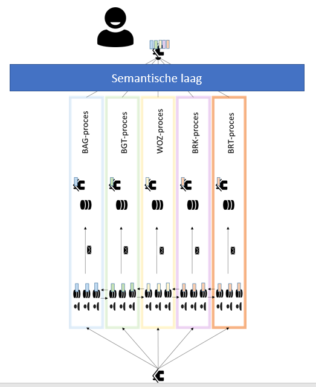
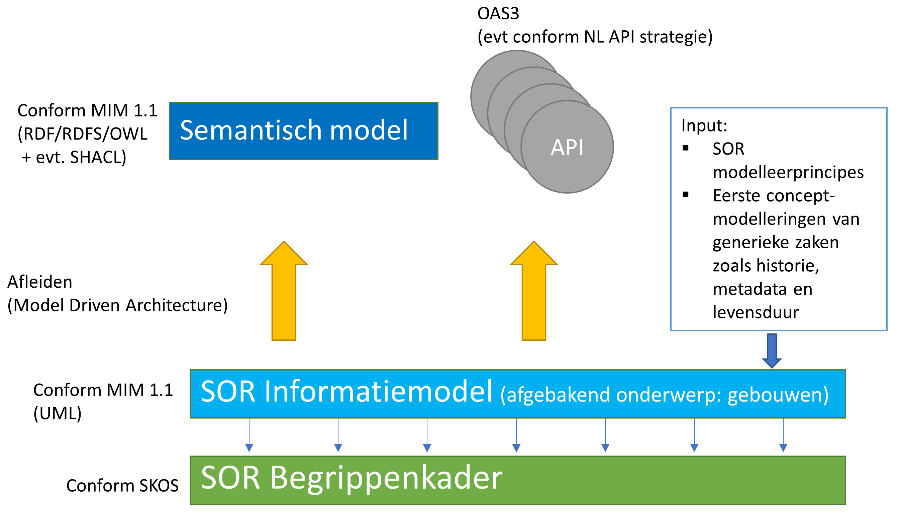

## Inleiding

In het kader van Doorontwikkeling in Samenhang van de Geo-basisregistraties (DiSGeo) zorgt Geonovum voor een stapsgewijze informatiemodellering van de Samenhangende Objecten Registratie, de SOR. 

De stapsgewijze ontwikkeling van het informatiemodel voor de SOR wordt zo opgezet dat de gegevensspecificaties uit de betrokken basisregistraties (BAG, BGT, BRT en deels de WOZ) op basis van [de eisen aan het model](https://docs.geostandaarden.nl/disgeo/emso/), behoudens bepaalde daarin geformuleerde wijzigingen, zo optimaal mogelijk een plek kunnen vinden in de nieuwe omgeving waardoor de aanvullende inspanning voor betrokkenen uit het werkveld in de bijhouding zo klein mogelijk wordt gehouden. 

<figure id="semantische-laag">
  
  <figcaption>Semantische laag en basisregistraties</figcaption>
</figure>

In dit kader is er ook ruimte om in inspirerende onderzoeksweken (High-5's) specifieke onderwerpen te onderzoeken en daaruit lessen te trekken die in het vervolg van de informatiemodellering kunnen worden toegepast.

### Waar komen we vandaan?

Alvorens dieper in de materie te duiken is het belangrijk om de context te begrijpen waarbinnen de huidige ontwikkelingen plaatsvinden. Bij het registreren van gegevens ontstaat er momenteel een tweedeling: aan de ene zijde het object waarnaar de registraties verwijzen, aan de andere zijde de registratieketens. Momenteel staan deze registratieketens centraal. Echter zijn er verschillen tussen ketenprocessen - in semantiek, actualiteit, etc. Om de ketenprocessen op elkaar af te stemmen worden onderlinge relaties gelegd via applicatiekoppelingen. In de praktijk is er echter toch behoefte aan een betere afstemming. Verschillende werkprocessen kunnen dan ondersteund worden vanaf het moment dat er een verandering plaatsvindt aan een object. 

Dit houdt in dat het straks mogelijk moet zijn om gegevens te kunnen aanpassen of bekijken per object: we gaan van losse registraties naar samenhangende gegevensobjecten. Op deze manier worden gebruikers niet belast met de manier waarop organisaties de data verwerkt hebben voor hun interne processen. 

Het informatiemodel van de SOR moet daarom een samenhangend gegevensmodel zijn. Dit heeft gevolgen voor de wijze van modelleren; in plaats van een model waarin de gegevens centraal staan, gaan we toe naar *object-centraal modelleren*. Iets dat we in deze High-5 onderzoeken. 

### Wat is in deze High-5 onderzocht

**Het doel:** te beproeven of het mogelijk is de basisregistraties in samenhang te bevragen, waarbij deze samenhang nog niet in de data (in de vorm van relaties tussen instanties) aanwezig is, en zonder de onderliggende registraties of de data die daarin staan aan te passen. De samenhang wordt gerealiseerd door een samenhangende, integrale semantische laag die ervoor zorgt dat vragen over registraties heen kunnen worden gesteld en beantwoord.

Een interessante invalshoek is een mogelijke samenhang met het [IGO traject van DisGeo](https://labs.kadaster.nl/cases/integralegebruiksoplossing). Een belangrijk inhoudelijk verschil tussen deze High-5 en het IGO-traject is dat men in het IGO kijkt naar integraal gebruik op basis van de beschikbare bronnen, en daarbij uit gaat van de bestaande gegevensstructuren. In het kader van de SOR kijken we primair gebruiksgericht, uitgaande van een samenhangend gegevensmodel; en van daar uit naar de databronnen. 

Deze High-5 is in 3 tijdsperioden uitgevoerd. Gedurende de eerste periode, in augustus 2021, is onderzoekenderwijs een overkoepelend informatiemodel "Gebouwen" ontwikkeld. In de tweede periode, in november 2021, is het "Gebouwen" model verder uitgewerkt en zijn er transponeringsregels geformuleerd die beschrijven hoe je gegevens uit de huidige basisregistraties kunt omzetten naar dit informatiemodel. In de derde periode, in januari 2022, zijn dit informatiemodel en de transponeringsregels geïmplementeerd in een softwareomgeving om te beproeven waar je dan tegenaan loopt. De insteek hierbij was om te ervaren in welke mate (60/40 / 70/30 / 80/20) het SOR resultaat haalbaar is op basis van de huidige basisregistraties, en te ontdekken op welke punten data-integratie bij de bronnen wél nodig is.

<figure id="modelleertaak-overzicht">
  
  <figcaption>Semantisch modelleerwerk</figcaption>
</figure>

Zoals op de afbeelding te zien is, hebben we gewerkt aan het informatiemodel voor de Samenhangende Objectenregistratie - beperkt tot het deel over gebouwen. Input hierbij waren de eisen aan de DiSGeo inhoud [[EMSO]], de door het modelleerteam opgestelde modelleerprincipes [[MODPR]] en de uitwerking die er al was voor enkele generieke onderwerpen [[GENDOC]]. Daarna zijn er, kijkend naar het IMSOR informatiemodel én de huidige basisregistraties en de data daarin, transponeringsregels opgesteld. Ook is er gekeken naar de aansluiting van een externe databron op het SOR Gebouw. Informatiemodel en transponeringsregels zijn vervolgens toegepast in de samenhangende laag die op basis van de transponeringsregels de orchestratie tussen de afnemende APIs en de bronregistraties verzorgt. Een drietal APIs voor afnemers zijn tenslotte daar bovenop gerealiseerd.

### Hoe doen we dat?

We maken op basis van de eisen aan de DiSGeo inhoud een beknopt informatiemodel, voor een afgebakend onderwerp. We hanteren hierbij zoals gezegd de door Geonovum, in samenwerking met de expertgroep DisGeo informatiemodel, opgestelde DisGeo modelleerprincipes en eerste concept-modelleringen van generieke zaken zoals historie, metadata en levensduur. Het informatiemodel is inclusief:

1. Begrippenkader (SKOS)
2. Informatiemodel conform MIM 1.1 (UML)

We passen Model Driven Architecture (MDA) toe. Uit het informatiemodel leiden we ten behoeve van de 2e High5 af:

- een RDF model i.e. een samenhangend semantisch model van het gekozen afgebakende onderwerp
- OAS 3 API’s

<figure id="samenhang">
  
  <figcaption>Model driven architecture</figcaption>
</figure>

### Hoofdvragen

1. “Object centraal modelleren”: Hoe doe je dit waarbij de gegevens van dit object uit verschillende registraties komen met verschillende contexten (definities, historie, …)
2. Hoe druk je de semantische integratielaag uit als context boven de verschillende registraties, waarin de gegevens zijn zoals ze zijn, en waarvan de integratielaag onafhankelijk is? Is de semantische integratielaag (met data centraal over meerdere registraties) de representatie van de samenhang in gegevenscatalogi?
3. Wat bedoelen we met een semantische laag?

### Verdiepende vragen

Behandeld:
1. Lukt het om een RDF model geautomatiseerd af te leiden uit het UML model, conform MIM 1.1?
2. Zijn er handmatige stappen nodig om het afgeleide RDF model ‘goed’ te maken, zoals bedoeld in het [NEN 3610 Linked Data profiel](https://docs.geostandaarden.nl/nen3610/nldp/#basisprincipes-normalisatie)?. 
3. Moet het informatiemodel een conceptueel of logisch model zijn en waarom? Wat is het verschil tussen de twee?
4. Op welke wijze zorgen we voor semantiek bij de bron? Hoe borgen we de MDA? M.a.w. hoe richten we de informatie-architectuur in?
5. Op welke manieren drukken we de relaties tussen objecten (en/of informatieobjecten) uit? Drukken we de samenhang uit met URI’s? Waar ontstaan ze en hoe houden we ze bij?
6. Zijn er verbeteringen te noemen voor de [DisGeo modelleerprincipes](https://geonovum.github.io/disgeo-imsor/modelleerprincipes/) (zijn ze houdbaar, zijn ze volledig, etc)?

Wel benoemd, maar nog niet aan toegekomen:
7.  Hoe kunnen we het informatiemodel relateren aan het begrippenkader? Wat is de relatie tussen die twee? En wat wordt de relatie tussen informatiemodel, begrippenkader en de data zelf?
8. Hoe kunnen we de verschillende producten (SKOS begrippenkader, UML informatiemodel, RDF model) publiceren?
9.  Wat voor afspraken zijn er te maken rondom URI patroon en het gebruik van URIs voor begrippen, ontologie, en data (hierbij aandacht voor URI’s in NL API strategie)? 

### Onderzoeksgebied: Gebouwen

Voor deze High-5 is gekozen voor een afgebakend onderzoeksgebied. We richten ons op het onderdeel [Gebouwen](https://docs.geostandaarden.nl/disgeo/emso/#gebouw) van de SOR omdat dit onderwerp raakt aan meerdere basisregistraties. Tijdens de High-5 is de scope binnen het onderwerp Gebouwen nog verder vernauwd. 

Daarnaast zijn in het kader van gebruik twee beleidsthema's geselecteerd die in samenhang hiermee bevraagd worden:
- Energielabels
- Energieafgiftepunten

Aan deze beleidsthema's zijn we in het implementatiedeel van de High-5 niet meer toe gekomen.

### Eerdere DiSGeo-high-5's 

In 2019 en 2020 zijn twee High-5's uitgevoerd in het kader van DiSGeo. 

1. [DiSGeo Demo 1 - Geodata in samenhang mbv huidige techniek bovenop APIs](https://docs.geostandaarden.nl/disgeo/dll/) (eind 2019). Deze is ontwikkeld door [Netage](https://netage.nl) en Geonovum in opdracht van BZK. 

*Uitgangspunt*: Maak een demonstrator over geodata in samenhang met behulp van huidige techniek bovenop API's.  

*Conclusies*: 
    - Diverse haken en ogen; 
    - API maturiteit viel tegen; 
    - APIs zijn de nieuwe silo’s; 
    - Semantische samenhang daarbovenop realiseren vereist een onderhoudsgevoelige semantische laag; 
    - Er is governance op het snijvlak nodig.

2. [DiSGeo Demo 2 - Geodata in samenhang waarbij wordt getoond wat Linked Data voor DiSGeo kan betekenen](https://docs.geostandaarden.nl/disgeo/dll2/) (zomer 2020). Deze is ontwikkeld door Kadaster, Provincie Noord-Holland, Netage, IHW, en Geonovum in opdracht van BZK.

*Uitgangspunt*: Maak een demonstrator geodata in samenhang waarbij wordt getoond wat Linked Data voor DiSGeo kan betekenen.  

*Conclusies*: 
    - Linked Data is geschikt (onmisbaar) om de DisGeo ambities met betrekking tot het in samenhang bevragen van de basisregistraties te realiseren;
    - Zowel als directe toegangslaag, en als basis voor API's en viewers;
    - Er zijn geen grote technische belemmeringen gevonden.

### Leeswijzer

Dit document is behoorlijk omvangrijk en beschrijft in feite het verloop en de resultaten van drie experimenteersessies, die op verschillende momenten in de tijd plaatsvonden maar toch één inhoudelijk samenhangende High-5 vormen. Het geheel van deze drie experimenteersessies wordt in dit document beschreven. 

De eerste twee experimenteersessies draaiden beide om de semantische modellering en de transponering van oud naar nieuw en hebben we daarom als één geheel beschreven. De derde sessie, waarin de software implementatie plaats vond, hebben we apart beschreven.

Het document valt daarom in verschillende delen uiteen: 
- Hoofdstuk  (dit hoofdstuk): de integrale inleiding over de gehele High-5 activiteit (het geheel van drie sessies).
- Hoofdstuk 2 t/m 12: beschrijven de semantische modellering en transponering en alles wat daarbij kwam kijken.
- Hoofdstuk  beschrijft de de opgedane inzichten en aanbevelingen  over informatiemodellering en over het specificeren van de transponering.
- Hoofdstuk 14 t/m 16: beschrijven de benodigdheden voor implementatie en de resultaten van de implementatie zelf.
- Hoofdstuk : beschrijft de opgedane inzichten en aanbevelingen over de implementatie.
