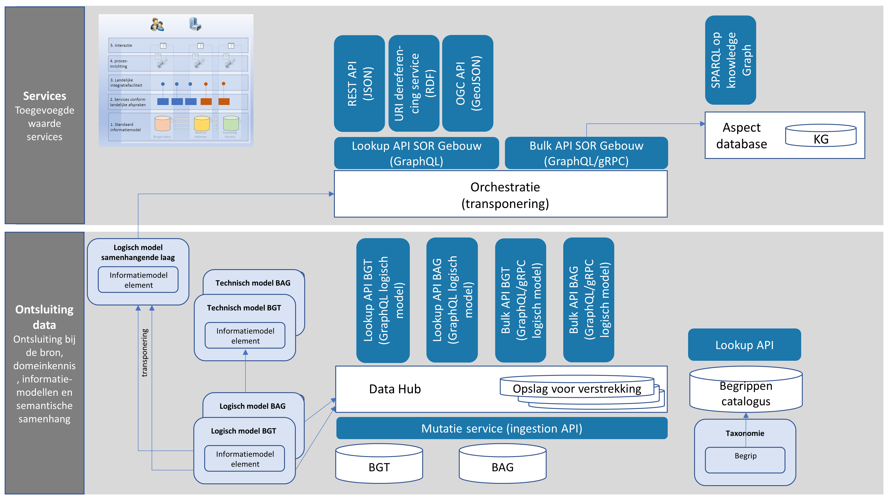

# Implementatiefase

<aside class="note">Voorlopig in dit hoofdstuk de beschrijving van de implementatiedagen van januari 2022. Later bekijken we hoe we dit integreren met het lessons learned document, of misschien toch een apart lessons learned dcocument voor de implementatie maken.</aside>

## Opzet

<figure>
    
    <figcaption>Architectuur van de implementatie</figcaption>
</figure>

De onderste laag van deze architectuur, ontsluiting bij de bron, is in de voorbereiding al gerealiseerd. In deze High 5 realiseren we de bovenste laag, Services, met daarin: 
- Een Lookup API SOR Gebouw, conform het informatiemodel uit . Deze API ondersteunt het gehele informatiemodel en regelt de orchestratie van BAG en BGT naar SOR. De REST API, OGC Features API en SPARQL Endpoint worden hier bovenop gebouwd.
- Een REST API die vragen over gebouwen ondersteunt en JSON + JSON-LD teruggeeft.
- Een OGC API Features die ruimtelijke vragen ondersteunt en GeoJSON teruggeeft, plus een client GIS viewer.
- Een SPARQL endpoint bovenop een knowledge graph.

Als proefgebied is voor Swifterbant (gemeente Dronten) gekozen. 

<aside class="note">We beginnen met het objecttype Gebouw. Waarschijnlijk komen we niet aan de andere objecttypen die in scope zijn (Gebouwcomponent, Verblijfsobject, Open Bouwwerk en Installatie) toe. We hadden de andere objecttypen vooral om de energielabels en energieafgiftepunten te kunnen koppelen.</aside>

## Resultaten

[TODO] Links / screenshots toevoegen van alles wat gemaakt is. 

## Bevindingen

- Wat zonder meer gelukt is
- Wat wel lukte maar met workarounds / moeite 
- Wat niet lukte

### Identificatie van SOR objecten
We introduceren nu geen SOR identificatie maar gebruiken hiervoor de identificatie uit de bestaande bronregistraties. Omdat er zowel BAG als BGT panden zijn, die samen in een Gebouw object moeten gevat worden, moest er gekozen worden welke identificatie leidend is. Dit is voor ons het BAG ID geworden. 

Er zijn ook SOR gebouwen die geen BAG id hebben, namelijk de BGT `OverigBouwwerk` objecten van het type `Bunker` en `Schuur`. Voor deze SOR gebouwen wordt het BGT id overgenomen. Als we er aan toe komen, want we beginnen met de BAG.

### Transponering

#### Mapping specificatie
We maken een declaratieve, machineleesbare specificatie van de mapping tussen BAG/BGT en SOR. De hele intelligentie van de transponering/mapping plaatsen we zo in de mapping specificatie. De Lookup API  hoeft alleen de mapping uit te voeren en kan daardoor generiek blijven. De vertaalspecificaties moeten twee kanten op werken voor een functionerende API: om gegevens in de bron(nen) te kunnen vinden gegeven een zoekvraag; en om gegevens te kunnen leveren in de doelstructuur (SOR model). 

Deze declaratieve, machineleesbare mappingspecificatie sluit aan bij MIM en zit qua opzet dichtbij de taal die we gebruiken voor het informatiemodel. Technisch is het een soort YAML dialect dat goed leesbaar is voor ontwikkelaars.

We brengen in deze taal de mogelijkheid aan om functies aan te roepen zodat ingewikkelde transformaties als een functie kunnen worden omschreven.

<aside class="issue">Het zou leuk zijn om een naam te hebben voor deze mapping spec taal...</aside>

#### Specificatie vanuit bron of doel
Je kunt bij het maken van zo'n mappingspecificatie twee kanten op. 
1. Je neemt de bron als uitgangspunt, en specificeert voor elk brongegeven wat de naam, structuur en inhoud van het resultaatgegeven moet zijn; een zogenaamde "push" transformatie.
1. Je neemt het gewenste resultaat als uitgangspunt, en specificeert voor elk resultaatgegeven waar je dat precies in de brondata kunt vinden; een zogenaamde "pull" transformatie ofwel "cherry-picking". 

Onze eerste uitdaging was: welke van deze aanpakken kunnen we het beste als uitgangspunt nemen? We hebben gekozen voor aanpak 2. Waarom? 
- In algemene zin is een push aanpak meer geschikt voor een mapping waarbij de doelstructuur erg lijkt op de bronstructuur, terwijl een pull aanpak beter werkt voor een mapping waarbij de doelstructuur erg afwijkt van de bron. De doel- en brongegevensstructuur verschillen niet fundamenteel van elkaar, wat zou pleiten voor een push aanpak; maar er zijn meer argumenten.
- De SOR is gespecificeerd vanuit het gewenste einddoel en SOR objecten zijn daardoor vaak een combinatie van meerdere bronobjecten, zodat er niet één enkel bronobject als uitganspunt genomen kan worden;
- De pull / cherry picking aanpak leent zich meer voor een geleidelijk ontwikkelproces waarbij er steeds meer gegevens aan de SOR objecten kunnen worden toegevoegd, ongeacht uit welke bronregistratie ze komen.

