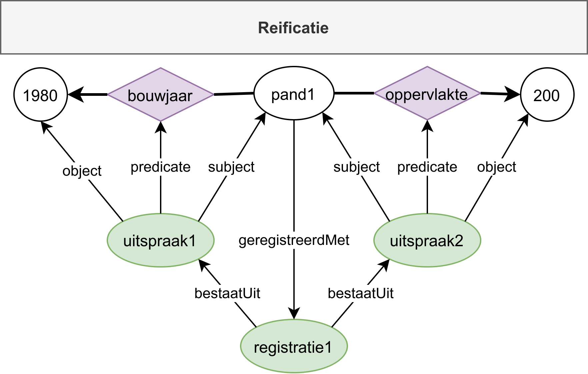
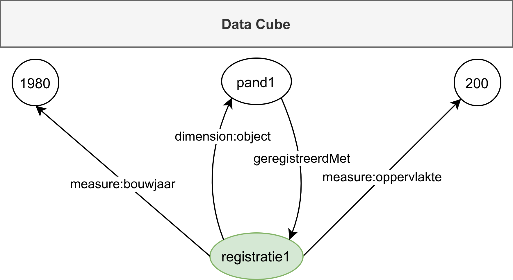
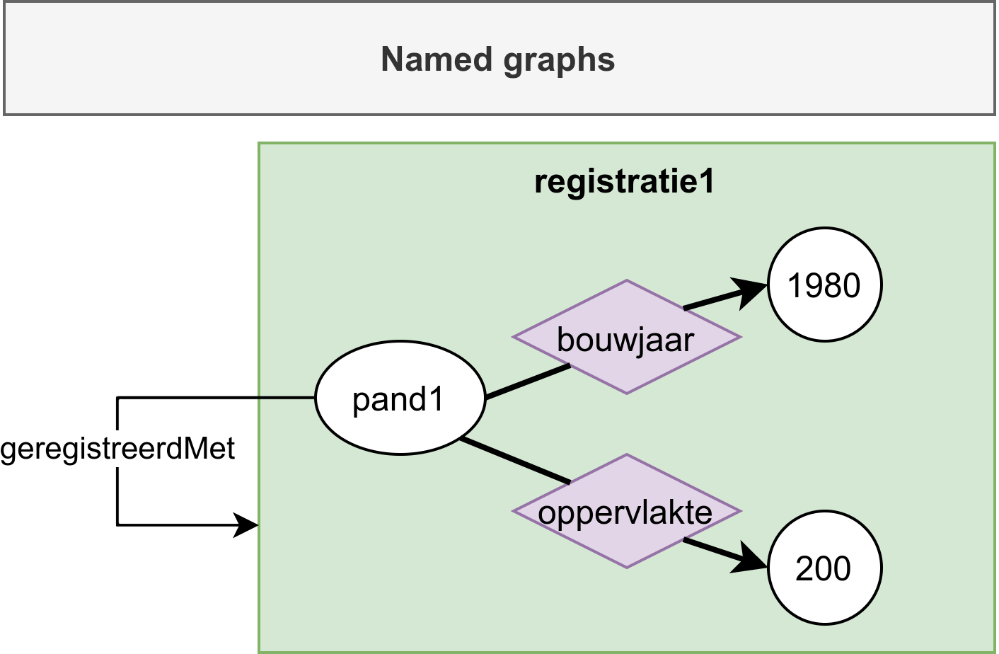
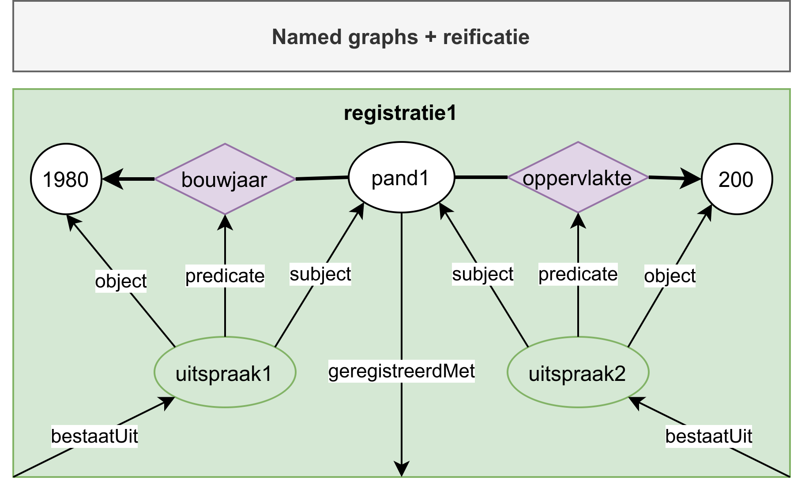
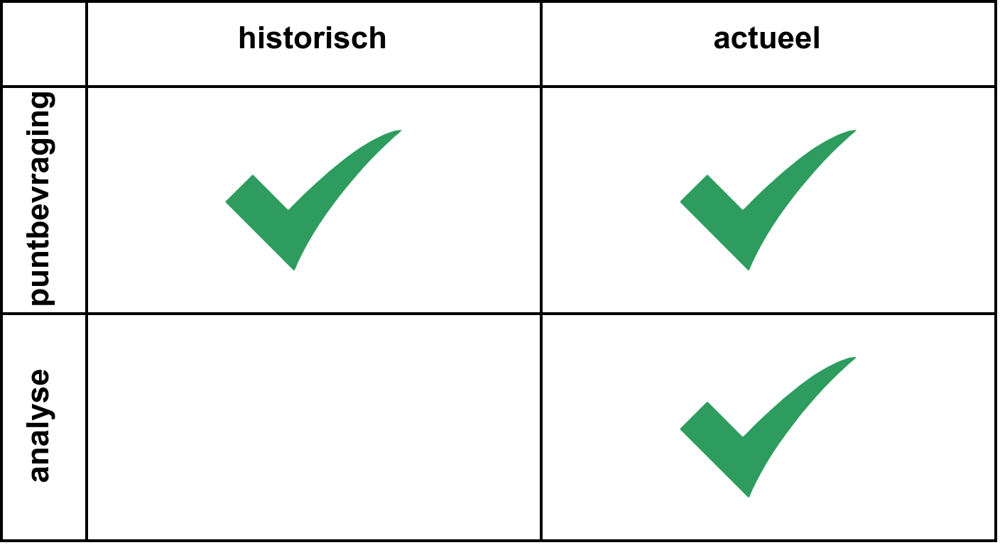

## Historie implementatie aspecten

Er zijn verschillende manieren waarop historie in linked data gerepresenteerd kan worden.  Deze manieren hebben verschillende voor- en nadelen die we hier inzichtelijk maken.  Hiervoor gebruiken we een versimpeld registratie object met twee eigenschappen (bouwjaar en oppervlakte).

### Variant 1: Uitspraak

Deze variant maakt gebruik van:
1. RDF uitspraken (<a href="">standaard</a>)
2. Registratie objecten (SOR-specifieke 'set')

<figure>
  
  <figcaption>
    Figuur 1 ― Historie opslag op basis van uitspraken.
  </figcaption>
</figure>

### Variant 2: Data Cube

Deze variant maakt gebruik van:
1. Data Cube observaties (<a href="">standaard</a>)
2. In Data Cube vastgelegde "dimensions" en "measures"

<figure>
  
  <figcaption>
    Figuur 2 ― Historie opslag op basis van Data Cube.
  </figcaption>
</figure>

### Variant 3: Graaf

Deze variant maakt gebruik van:
1. RDF graaf namen (<a href="">standaard</a>)

<figure>
  
  <figcaption>
    Figure 3 ― Historie opslag op basis van graphs.
  </figcaption>
</figure>

### Variant 4: Graaf+Uitspraak

Deze variant maakt gebruik van:
1. RDF graaf namen (<a href="">standaard</a>)
2. RDF uispraken (<a href="">standaard</a>)

<figure>
  
  <figcaption>
    Figure 4 ― Historie opslag op basis van graphs.
  </figcaption>
</figure>

### Implementatie kwadranten

<figure>
  
  <figcaption>
    Figure 6 ― De vier implementatie kwadranten.
  </figcaption>
</figure>
