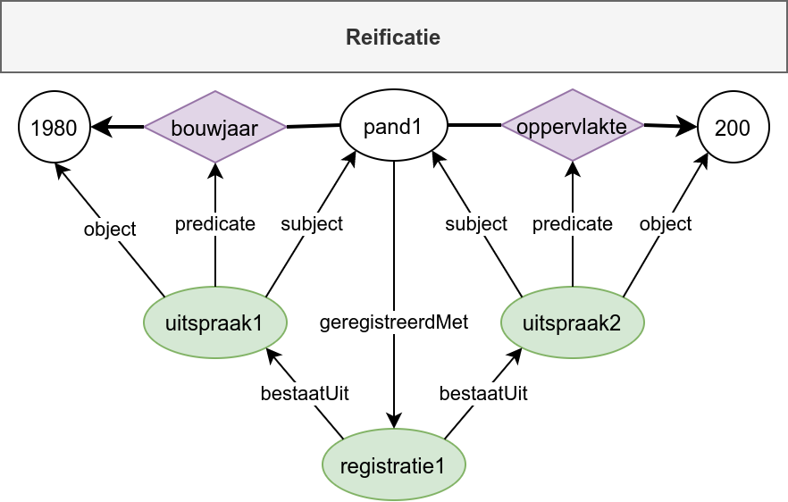
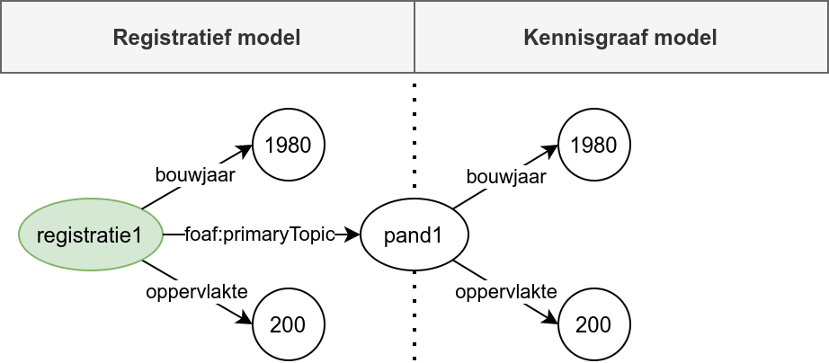

## Historie implementatie aspecten

Er zijn verschillende manieren waarop historie in linked data gerepresenteerd kan worden.  Deze manieren hebben verschillende voor- en nadelen die we hier inzichtelijk maken.

### Variant 1: Uitspraak reïficatie

In deze variant wordt de historie volledig weergegeven binnen de graaf structuur zelf.  De graaf structuur bevat zowel de uitspraken over objecten, alsook de registratieve gegevens die bij die uitspraken horen (bijvoorbeeld begin- en eind geldigheid).  Een visuele weergave hiervan is te vinden in Figuur 1.

Het afzonderlijk representeren van uitspraken als op zichzelfstaande entiteiten wordt in linked data “uitspraak reïficatie” genoemd.

Deze variant maakt gebruikt van:
1. Standaard RDF triples.
2. RDF uitspraak reïficatie.
3. Sets van RDF uitspraken

    Figuur 1 ― Historie representatie op basis van uitspraak reïficatie.

### Variant 2: Graaf reïficatie

In deze variant wordt de historie weergegeven binnen en buiten de graaf structuur.  De graaf structuur bevat de uitspraken over objecten.  De registratieve gegevens over die uitspraken worden toegekend aan de totale graaf waarin de uitspraken over objecten zich bevinden.  Een visuele weergave hiervan is te vinden in Figuur 2.

Het afzonderlijk representeren van grafen als op zichzelfstaande entiteiten wordt in linked data “graaf reïficatie” genoemd.

Deze variant maakt gebruik van:
1. Standaard RDF triples.
2. RDF graaf reïficatie.

    Figuur 2 ― Historie representatie op basis van graaf reïficatie.

### Variant 3: Graaf reïficatie + uitspraak reïficatie

In deze variant wordt de historie weergegeven binnen en buiten de graaf.  Binnen de graaf bevinden zich zowel uitspraken over objecten, alsook sommige registratieve gegevens over die uitspraken.  Hiervoor wordt binnen de graaf gebruik gemaakt van uitspraak reïficatie.  Naast de registratieve gegevens binnen de graaf zijn er ook registratie gegevens die over de graaf zelf gaan.  Hiervoor wordt graaf reïficatie toegepast.  Een visuele weergave hiervan is te vinden in Figuur 3.

Deze variant maakt gebruik van:
1. Standaard RDF triples.
2. RDF uitspraak reïficatie.
3. RDF graaf reïficatie.

    Figuur 3 ― Historie opslag op basis van graphs.

### Variant 4: Ontkoppeling

In deze variant wordt de representatie van observaties losgekoppeld van de representatie van objecten.  Beide representaties worden weergegeven binnen de graaf structuur en zijn verbonden middels een herleidbaarheidsrelatie.  Inhoudelijke eigenschappen komen twee keer voor: één keer op het niveau van de observatie en één keer op het niveau van het object.  Een visuele weergave hiervan is te vinden in Figuur 4.

Deze aanpak wordt momenteel toegepast binnen IGO.

Deze variant maakt gebruikt van:
1. Standaard RDF triples.

    Figuur 4 ― Historie representatie op basis van ontkoppeling.

### Variant 5: Ontkoppeling + Data Cube

Deze variant lijkt op variant 4, maar maakt gebruik van de [Data Cube](https://www.w3.org/TR/vocab-data-cube/) standaard om de uitspraken over observaties op een gestandaardideerde manier vast te leggen.  Een visuele weergave hiervan is te vinden in Figuur 5.

    Figuur 5 ― Historie representatie op basis van ontkoppeling en Data Cube.

## Vergelijkingstabel

<figure>
  <table>
    <thead>
      <tr><th></th><th>1</th><th>2</th><th>3</th><th>4</th><th>5</th></tr>
    </thead>
    <tbody>
      <tr><th>duplicatie van eigenschappen</th><td>+</td><td>+</td><td>+</td><td>-</td><td>-</td></tr>
      <tr><th>standaards-conform</th><td>+</td><td>+</td><td>+</td><td>-</td><td>+</td></tr>
      <tr><th>metadata opslag op uitspraak niveau</th><td>+</td><td>-</td><td>+</td><td>-</td><td>+</td></tr>
      <tr><th>technische haalbaarheid: grafen</th><td>+</td><td>-</td><td>-</td><td>+</td><td>+</td></tr>
      <tr><th>technische haalbaarheid: reïficatie</th><td>-</td><td>+</td><td>-</td><td>+</td><td>+</td></tr>
    </tbody>
  </table>
  <figcaption>
    Tabel 1 ― Vergelijking tussen de voor- en nadelen van de verschillende varianten voor historie representatie in linked data.
  </figcaption>
</figure>
