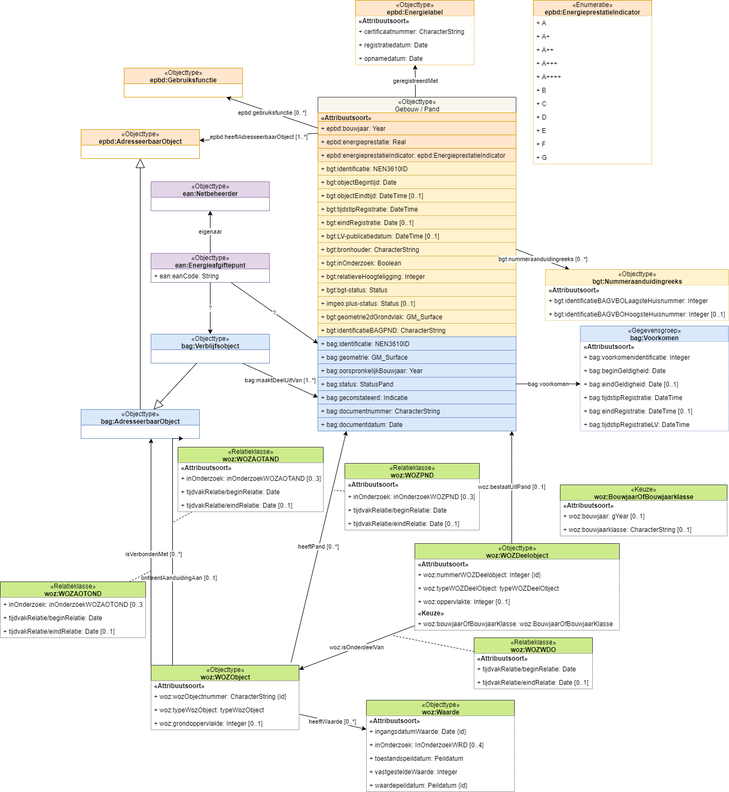

## Scope van de high 5

### Scope-bepalende vragen

Startpunt:
- Het eisen aan SOR document [[EMSO]]. Dat is de laatste stand van zaken. De laatste inzichten van de DisGeo werkgroep Inhoud - Gebouwen is daarin terechtgekomen. 
- Zie in dat document vooral ook het hoofdstuk Transitie / transponering. Daar staat de relatie met de huidige registraties. 
- Dus we nemen niet de informatiemodellen van de huidige BRs als uitgangspunt. Maar we kijken er wel naar, om te zien hoe deze zich verhouden tot het gewenste SOR model en wat er aan eventuele afleidingsregels nodig is.

*Hoe zit het met 3D representaties van objecten?*
- Deze zitten nu niet in een basisregistratie. Maar de 3D basisvoorziening bevat al wel 3D representaties van BAG/BGT objecten en ook de relatie met deze objecten is vastgelegd. Je kan dus het 3D model bij een object opvragen. 
- LOD: 1.3, in de toekomst wordt dit 2.1. 
- De 3D modellen zijn met een bepaalde methode afgeleid uit de basisdata.
- We gaan nu uit van wat je uit de basisregistraties kan halen plus kan berekenen. 

*BRT in scope?*
- Het is in scope van de SOR dus in eerste instantie ook van deze high 5. 
- Hier zijn wel kanttekeningen bij te plaatsen omdat relatie met BGT/BAG lastig is. 
- Wel een reden om ze in scope te plaatsen, is dat je zou kunnen onderzoeken hoe generalisatie in de semantische laag kan worden gedefinieerd. 
- BRT is ook interessant omdat het rijk is aan functies, ook voor gebouwen. Maar je hebt ook functies in de WOZ. In het EMSO is een combinatie gemaakt van gebouwfuncties en WOZ functies, dit is de type lijst bij SOR Gebouw geworden.
- IGO heeft een analyse gedaan van de verhouding tussen BRT objecten en functies met andere basisregistraties. Zij hebben oa gevonden dat er een n op n relatie is tussen BRT en BAG/BGT. 
- Er staan ook wel wat gebouwen in de BRT die niet in de BAG/BGT staan. 
- BRT transponering staat niet in EMSO beschreven. 
- BRT parkeren voor deze high 5, misschien komt het aan bod maar in eerste instantie nog niet.

*Wat is de relatie van energielabels met de SOR?*
- Energielabels kunnen aan een deel van een gebouw of aan een verblijfsobject hangen. Wat is dit 'deel van gebouw'? Energielabels hangen soms aan een ruimtelijke 'koker' binnen een flatbebouw; daar lijkt een soort gebouwzone handig voor, maar in de huidige definitie past dat niet, want een gebouwzone moet zich binnen een verdieping bevinden. Je zou hiervoor iets als de CityGML `BuildingUnit` moeten hebben.
- Er is geen informatiemodel energielabels, er is alleen een proza beschrijving. 
- Je kan altijd van een verblijfsobject het energielabel vinden, maar een energielabel kan aan verschillende verblijfsobjecten hangen. 
- Is het energielabel een object of is het een eigenschap van een verblijfsobject? 
- Energielabel is typisch een gegeven van buiten de SOR; het moet mogelijk zijn voor een externe partij om dit te koppelen aan een SOR object. Dus wel in scope van deze high 5, mooie case om externe gegevens aan de SOR te koppelen.

### Verwijzingen naar informatiemodellen

*Informatiemodel BAG*

- [Gegevenscatalogus BAG](https://www.geobasisregistraties.nl/documenten/publicatie/2018/03/12/catalogus-2018)
- [Datamodel BAG](https://bag.basisregistraties.overheid.nl/datamodel)
- [Begrippenkader BAG](https://bag.basisregistraties.overheid.nl/resource?subject=https://bag.basisregistraties.overheid.nl/doc/begrippenkader/bag)

*Informatiemodel BGT*

- [Gegevenscatalogus BGT](https://docs.geostandaarden.nl/imgeo/catalogus/bgt/)
- [Informatiemodel IMGeo EAP en XMI](https://register.geostandaarden.nl/informatiemodel/imgeo/2.2/)
- [Begrippenkader IMGeo](https://definities.geostandaarden.nl/imgeo)

*Informatiemodel BRT*

- [Gegevenscatalogus BRT](https://www.kadaster.nl/-/brt-catalogus-productspecificaties)
- [Datamodel BRT](https://brt.basisregistraties.overheid.nl/datamodel)
- [Informatiemodel BRT EAP en XMI](https://register.geostandaarden.nl/informatiemodel/imbrt/1.2.3/)
- [Begrippenkader BRT](https://brt.basisregistraties.overheid.nl/resource?subject=https://brt.basisregistraties.overheid.nl/doc/begrippenkader/top10nl)

*Informatiemodel WOZ*

- [Documentatie IMWOZ, bespreekversie 6-8-2021](https://imvertor-tst.armatiek.nl/modellen/IMWOZ/IMWOZ.html)

*Informatie over energielabels*

- [Informatiepagina RVO](https://www.rvo.nl/onderwerpen/duurzaam-ondernemen/gebouwen/hulpmiddelen-tools-en-inspiratie-gebouwen/ep-online)

*Informatie over energieafgiftepunten*

- [Casebeschrijving energieafgiftepunten](https://github.com/Geonovum/disgeo-demo-3a/blob/main/energieafgiftepunten/afgiftepunten.md)

### Gebouw in de huidige registraties

In de huidige basis- en sectorregistraties zijn er veel gegevens te vinden over een "gebouw". Als de scope van deze high5 hebben we de de informatiemodellen van deze registraties genomen:
* BAG
* BGT
* WOZ
* EPBD - Energielabels
* EAN - Energie afgiftepunten

 In onderstaand plaatje hebben we getracht om deze te combineren tot één informatiemodel, zonder scherp te kijken naar de specifieke definitie van gebouw, noch kijkende naar de betekenis van eigenschappen.

<figure id="gebouw-huidige-registraties">
  
  <figcaption>Gebouw en aanverwante gegevens in huidige registraties</figcaption>
</figure>

Dit plaatje gebruiken we als startpunt voor de ontwikkeling tijdens de high-5 van een logisch SOR-informatiemodel voor gebouwen.

